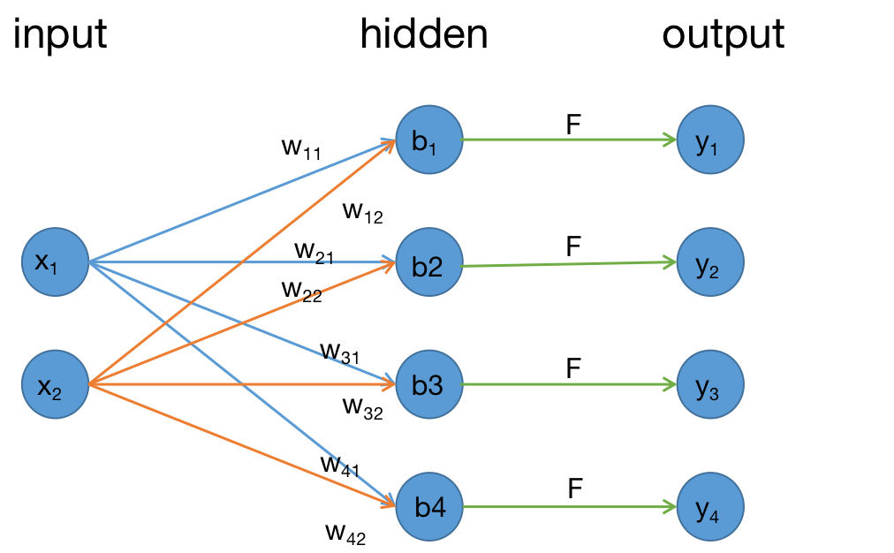
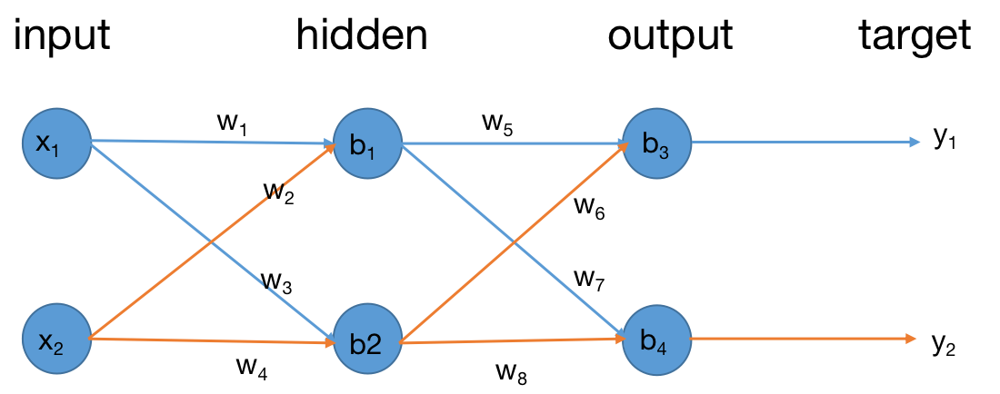

# Bert模型剖析
## **前言**
* Bert模型作为18年以来至今，一直是深度学习领域内的明星存在，其采用Transformer编码器作为核心结构，并通过大规模语料进行预训练，使得其具备了非常优秀的泛化能力，尤其是在自然语言处理领域中，仅需要使用特定下游领域的语料对Bert进行微调，便可在相应任务中得到非常好的表现。
* 虽然Bert已经诞生4年之久，网上也有许许多多关于Bert的见解文章，但在实际的工作和学习中还是回频繁于Bert打交道，也正是这些经历让自己意识到对Bert的了解还不够深入和清晰，和大多数朋友一样，虽然能够将Bert模型在自己的任务和数据集上跑起来，但是对于Bert模型本身仍然是存在一层神秘的面纱，如何将黑盒子打开，去明晰其中的脉络就是本项目记录的初衷。
* 我始终坚持认为深度学习的本质无外乎两点：**1.用机器语言表示人类语言；2. 模型的本质就是通过数值的矩阵变换+非线性变换拟合实际映射关系。** 正是因为这两点，在摸清楚模型内部的矩阵变化后，也就摘掉了模型的面纱。
## **前馈神经网络**
深度学习的领域类充斥着各种各样的网络模型结构，RNN、CNN、LSTM等，这些成熟的网络模型实则是由诸多不同的网络层组合而成。在进行神经网络的学习之初，前馈神经网络（全连接网络）是我们接触的初个简单网络层架构，因此以前馈神经网络为对象，将深度学习中的两大过程**前向传递**和**反向传播**进行说明。\
\

上图所示为一个**输入特征数为2，输出特征数为4的全连接层网络且只有一个隐藏层**的全连接网络，为了后续计算说明更加方便，这也使得上图和其它有关全连接层的介绍图有些许差别，但不影响对原理的了解。
### **变量说明**
如图所示，网络共涉及到输入层、隐藏层、输出层三层。
* 输入层代表的是网络层的输入，图中所示的输入$X$包含了2个特征。
  $$X=[x_1,x_2]，size=(1,2)$$
* 隐藏层代表的是网络层的权重参数$W$和偏置参数$b$，以及对应的激活函数$F$。无论是权重、偏置还是激活函数都是实现矩阵变换的数学操作，其中每一个隐藏层节点包含了2个权重参数和1个偏置参数，因此上图所示的参数量为$(2+1)*4=12$。
$$
W=
\begin{bmatrix}
w_{11} & w_{12}\\
w_{21} & w_{22}\\
w_{31} & w_{32}\\
w_{41} & w_{42}
\end{bmatrix},size=(4,2)
$$
$$
b=
\begin{bmatrix}
b_{1}\\
b_{2}\\
b_{3}\\
b_{4}
\end{bmatrix},size=(4,1)
$$
* 输出层代表的是网络层的输入，图中所示的输出$X$包含了4个特征。
  $$Y=[y_1,y_2,y_3,y_4]，size=(1,4)$$
### **从矩阵变换角度看模型的前向传递**
* 全连接神经网络层的前向传递，在huggingface开源的pytorch中的计算源码里对全连接层是这样描述的：    
    > Applies a linear transformation to the incoming data: :math:`y = xA^T + b`
* 结合上图所示，矩阵运算的计算逻辑如下：
  $$Y=X * W^T + b$$
 $$
[y_1,y_2,y_3,y_4]=[x_1,x_2]*\begin{bmatrix}
w_{11} & w_{21} & w_{31} & w_{41}\\
w_{12} & w_{22} & w_{32} & w_{42}
\end{bmatrix} + \begin{bmatrix}
b_{1}\\
b_{2}\\
b_{3}\\
b_{4}
\end{bmatrix}
 $$
* 按照矩阵运算展开各个输入特征、权重、偏置到输出特征的计算逻辑如下：
  $$
  \begin{cases}
  y_1 = (x_1*w_{11} + x_2*w_{12})+b_1 \\
  y_2 = (x_1*w_{21} + x_2*w_{22})+b_2 \\
  y_3 = (x_1*w_{31} + x_2*w_{32})+b_3 \\
  y_4 = (x_1*w_{41} + x_2*w_{42})+b_4
  \end{cases}
  $$
* 从$size$变化角度看: 
  $$
  X(1,2)*W^T(2,4)->(1,4); \\(1,4)+b(1,4)->Y(1,4)
  $$
* 在输入经过模型权重和偏置参数的变换后，最后经过激活函数完成整个全连接层的前向传递： $Y=F(Y)$
### **结合具体的数值运算看反向传播**
我们以一个二层的前馈神经网络进行反向传播的说明，在这个传播过程中，我们会给各个变量指定初值，此外还对学习率、损失函数、激活函数进行了指定。通过结合具体的数值进行一轮的正反向传播计算，方便对模型的优化迭代有更加直观的感受，同时给到响应的代码进行验证。

* 输入初值的指定
$$
\begin{bmatrix}
x_{1} & x_{2} 
\end{bmatrix} =\begin{bmatrix}
0.05 & 0.1 
\end{bmatrix}
$$
* 目标值的指定
$$
\begin{bmatrix}
y_{1} & y_{2} 
\end{bmatrix} =\begin{bmatrix}
0.01 & 0.99 
\end{bmatrix}
$$
* 权重和偏置的初值指定
$$
\begin{bmatrix}
w_{1} & w_{2} & w_{3} & w_{4}\\
w_{5} & w_{6} & w_{7} & w_{8}
\end{bmatrix} =\begin{bmatrix}
0.15 & 0.20 & 0.25 & 0.30\\
0.40 & 0.45 & 0.50 & 0.55
\end{bmatrix}
$$
$$
\begin{bmatrix}
b_{1} & b_{2} & b_{3} & b_{4}
\end{bmatrix} =\begin{bmatrix}
0.35 & 0.35 & 0.60 & 0.60
\end{bmatrix}
$$
* 学习率的指定
$$lr=0.5$$
* 激活函数的指定
$$F = sigmoid$$
* 损失函数的指定
$$ Loss = \sum_i1/2(x_{i} - y_{i})^2$$
#### **正向传播**
* input->hidden
  $$
    \begin{cases}
    hidden1^{'}= x_{1}*w_{1}+x_{2}*w_{2}+b_{1} = 0.3775 \\
    hidden1= sigmoid(hidden1^{'})=\frac{1}{1+e^{-0.3775}}=0.5932699921
    \end{cases}
  $$
  $$
    \begin{cases}
    hidden2^{'}=x_{1}*w_{3}+x_{2}*w_{4}+b_{2}=0.3925\\
    hidden2= sigmoid(hidden2^{'})=\frac{1}{1+e^{-0.3925}}=0.5968843782
    \end{cases}
  $$
* hidden->output
  $$
    \begin{cases}
    output1^{'} = hidden1*w_{5}+hidden2*w_{6}+b_{3}=1.105905967\\
    output1= sigmoid(outout1^{'})=\frac{1}{1+e^{-1.105905967}}=0.7513650695
    \end{cases}
  $$
  $$
    \begin{cases}
    output2^{'} = hidden1*w_{7}+hidden2*w_{8}+b_{4} = 1.224921404\\
  output2= sigmoid(output2^{'})=\frac{1}{1+e^{-1.224921404}}=0.7729284653
    \end{cases}
  $$
* output->loss
  $$
  loss=1/2*((output1-y_{1})^2 + (output2-y_{2})^2)=1/2*((0.7513650695-0.01)^2+(0.7729284653-0.99)^2)=0.2983711087
  $$
#### **反向传播**
* output层参数梯度计算
  $$
  \frac{\partial loss}{\partial output1} = 2 * 1/2 *(output1-y1)*1+0=0.7413650695
  $$
  $$
  \frac{\partial output1}{\partial output1^{'}}=output1*(1-output1)=0.751365095*(1-0.751365095)=0.186815589
  $$
  $$
  \frac{\partial output1^{'}}{\partial w_{5}} = hidden1+0+0=0.5932699921
  $$
  $$
  \frac{\partial loss}{\partial w_{5}} = \frac{\partial loss}{\partial output1}*\frac{\partial output1}{\partial output1^{'}}*\frac{\partial output1^{'}}{\partial w_{5}}=0.7413650695*0.186815589*0.5932699921=0.0821670349
  $$
  同理可计算得到
  $$
  \frac{\partial loss}{\partial w_{6}} = 0.0826676221,
  \frac{\partial loss}{\partial w_{7}} = -0.0226025404,
  \frac{\partial loss}{\partial w_{8}} = -0.0227402422,
  \frac{\partial loss}{\partial b_{3}} = 0.1384985521,
  \frac{\partial loss}{\partial w_{4}} = -0.0380982365
  $$
* output层参数更新
  $$
  \begin{bmatrix}
  w_{5} & w_{6} & w_{7} & w_{8}
  \end{bmatrix}-lr*
  \begin{bmatrix}
  \frac{\partial loss}{\partial w_{5}} & \frac{\partial loss}{\partial w_{6}} & \frac{\partial loss}{\partial w_{7}} & \frac{\partial loss}{\partial w_{8}}
  \end{bmatrix}=\begin{bmatrix}
  0.3589164825 & 0.4086661889 & 0.5113012702 & 0.5613701211
  \end{bmatrix}
  $$
  $$
  \begin{bmatrix}
  b_{3} & b_{4}
  \end{bmatrix}-lr*
  \begin{bmatrix}
  \frac{\partial loss}{\partial b_{3}} & \frac{\partial loss}{\partial b_{4}}
  \end{bmatrix}=  \begin{bmatrix}
  0.5307507239 & 0.6190491182
  \end{bmatrix}
  $$

* hidden层参数梯度计算
  $$
  \frac{\partial loss}{\partial hidden1} = \frac{\partial loss}{\partial output1}*\frac{\partial output1}{\partial output1^{'}}*\frac{\partial output1^{'}}{\partial hidden1} + \frac{\partial loss}{\partial output2}*\frac{\partial output2}{\partial output2^{'}}*\frac{\partial output2^{'}}{\partial hidden1}\\=0.7413650695*0.186815589*0.40+(-0.2170715347)*0.1755100528*0.50=0.0363503025
  $$
  $$
  \frac{\partial hidden1}{\partial hidden1^{'}}=hidden1*(1-hidden1)=0.5932699921*(1-0.5932699921)=0.2413007085
  $$
  $$
  \frac{\partial hidden1^{'}}{\partial w_{1}}=x_{1}+0+0=0.05
  $$
  $$
  \frac{\partial loss}{\partial w_{1}}=\frac{\partial loss}{\partial hidden1}*\frac{\partial hidden1}{\partial hidden1^{'}}*\frac{\partial hidden1^{'}}{\partial w_{1}}=0.0363503025*0.2413007085*0.05=0.0004385676
  $$
  同理可计算得到
   $$
  \frac{\partial loss}{\partial w_{2}} = 0.0008771353,
  \frac{\partial loss}{\partial w_{3}} = 0.0004977126,
  \frac{\partial loss}{\partial w_{4}} = 0.0009954253,
  \frac{\partial loss}{\partial b_{1}} = 0.0087713537,
  \frac{\partial loss}{\partial b_{2}} = 0.0099542536
  $$
* hidden层参数更新
  $$
  \begin{bmatrix}
  w_{1} & w_{2} & w_{3} & w_{4}
  \end{bmatrix}-lr*
  \begin{bmatrix}
  \frac{\partial loss}{\partial w_{1}} & \frac{\partial loss}{\partial w_{2}} & \frac{\partial loss}{\partial w_{3}} & \frac{\partial loss}{\partial w_{4}}
  \end{bmatrix}=\begin{bmatrix}
  0.1497807162 & 0.1995614323 & 0.2497511437 & 0.2995022873
  \end{bmatrix}
  $$
  $$
  \begin{bmatrix}
  b_{1} & b_{2}
  \end{bmatrix}-lr*
  \begin{bmatrix}
  \frac{\partial loss}{\partial b_{1}} & \frac{\partial loss}{\partial b_{2}}
  \end{bmatrix}=  \begin{bmatrix}
  0.3456143231 & 0.3450228732
  \end{bmatrix}
  $$
